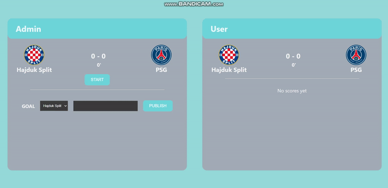

# Football Match Results

This project is a football match results application built using React with TypeScript. It allows users to start and manage football matches, record scores for each team, and select the player who has scored a goal.

## Live Demo

You can view the live demo of the project [here](https://spectacular-daifuku-b1dc34.netlify.app/).

## Description

The Football Match Results application is designed to provide users with a platform to start and manage football matches, record scores for each team during the match, and select the player who has scored a goal. Team data is fetched from a JSON file (`Teams.json`) to provide information about the teams involved.

## Video GIF Showcase

## Technologies Used

- React with TypeScript: Used for building the frontend interface and managing state.
- JavaScript: Utilized for scripting functionalities and interactions.
- CSS: Employed to style the application, ensuring visual coherence and a seamless user experience, including responsiveness for mobile devices.
- JSON: Used to fetch team data from the `Teams.json` file, providing information about the teams involved.
- Netlify: Hosting platform used for deploying the application online.

## Features

- Start and manage football matches with customizable timers.
- Record scores for each team during the match.
- Select player who has scored a goal.

## Contribution

Contributions to the project are welcome. If you have any suggestions for further improvements or would like to report any issues, please feel free to submit a pull request or open an issue on GitHub.

